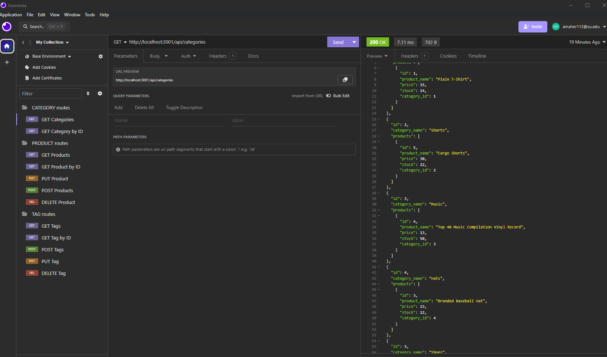

# E-Commerce Back End

## Description
This project takes a full stack application and writes back end code for an e-commerce site. I was responsible for the API routes, model code, and testing endpoints in Insomnia. With this application you can GET all models, as well as update, create and delete information from the database.

## Usage
Walkthrough video: 
https://drive.google.com/file/d/1JuNs-_hYQI7hY0-ZKhpHeTvPsNeAWaoV/view?usp=sharing

